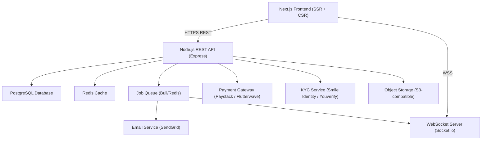

# Design Document: Backr Platform

## Overview

Backr is a creator-first crowdfunding and engagement platform targeting musicians, filmmakers, visual artists, writers, podcasters, and community creators — primarily in Africa and emerging markets. The MVP delivers:

- Creator registration with KYC identity verification
- Public creator profiles and campaign pages
- Campaign creation with isolated project wallets
- Transparent spending logs and real-time dashboards
- Backer contribution flow via Flutterwave/Paystack
- Backr Boost paid promotion
- Email marketing tool (premium)
- Project updates and social sharing
- Premium subscriptions
- Platform-wide campaign discovery and search

The platform is a server-rendered Next.js web application backed by a Node.js API layer and a PostgreSQL database. Real-time updates are delivered via WebSockets (Socket.io). Payments are processed through Paystack (primary) with Flutterwave as fallback, supporting NGN, KES, GHS, ZAR, and USD.

---

## Architecture

### High-Level Architecture



### Deployment

- Frontend + API: Deployed on a single Next.js app (API routes under `/api/*`)
- Database: Managed PostgreSQL (e.g. Supabase or Railway)
- Redis: Managed Redis instance for caching and job queues
- Storage: AWS S3 or Cloudflare R2 for KYC documents, receipts, avatars, and media
- All traffic over TLS 1.2+

### Key Design Decisions

1. **Next.js for SSR**: Campaign pages need Open Graph meta tags and fast initial loads for social sharing — SSR is the right fit.
2. **Isolated Project Wallets**: Each campaign has its own wallet row in the DB, preventing cross-campaign fund mixing and enabling transparent per-campaign accounting.
3. **Webhook-driven payment confirmation**: Payment gateway webhooks (not client redirects) are the authoritative source of payment confirmation, preventing fraud.
4. **Bull queue for async work**: Email delivery, KYC polling, and notification dispatch are handled asynchronously via Bull queues backed by Redis.
5. **Soft-delete audit log**: Spending entries and updates are soft-deleted so the immutable audit trail is preserved for admins.

---

## Components and Interfaces

### 1. Auth Service

Handles registration, login, session management, 2FA, and account lockout.

```
POST /api/auth/register          — create account, trigger verification email
POST /api/auth/verify-email      — activate account via token
POST /api/auth/login             — issue JWT + refresh token
POST /api/auth/logout            — invalidate refresh token
POST /api/auth/2fa/setup         — enrol TOTP or SMS 2FA
POST /api/auth/2fa/verify        — verify 2FA code
POST /api/auth/refresh           — rotate access token
```

### 2. KYC Service

Wraps the third-party KYC provider (Smile Identity or Youverify).

```
POST /api/kyc/submit             — upload ID + selfie, create KYC job
GET  /api/kyc/status             — poll current KYC status
POST /api/kyc/webhook            — receive async result from KYC provider
```

### 3. Creator Profile Service

```
GET  /api/creators/:username     — public profile
PUT  /api/creators/me            — update bio, avatar, social links, category
PUT  /api/creators/me/username   — change username (uniqueness check)
```

### 4. Campaign Service

```
POST /api/campaigns              — create campaign + provision wallet
GET  /api/campaigns              — list/search/filter campaigns (public)
GET  /api/campaigns/:slug        — single campaign public page
PUT  /api/campaigns/:id          — edit description, cover image
POST /api/campaigns/:id/publish  — make campaign publicly visible
POST /api/campaigns/:id/cancel   — cancel campaign (pre-funds check)
```

### 5. Wallet & Transaction Service

```
GET  /api/campaigns/:id/wallet          — wallet balance + totals
POST /api/campaigns/:id/withdraw        — initiate withdrawal (triggers 2-step)
POST /api/campaigns/:id/withdraw/verify — confirm OTP, process withdrawal
POST /api/payments/webhook              — payment gateway webhook handler
```

### 6. Spending Log Service

```
POST /api/campaigns/:id/spending        — add spending entry
GET  /api/campaigns/:id/spending        — list public spending entries
DELETE /api/campaigns/:id/spending/:eid — soft-delete entry
```

### 7. Dashboard Service (Real-time)

```
GET  /api/campaigns/:id/dashboard       — initial dashboard snapshot
WS   /campaigns/:id/dashboard           — Socket.io room for live updates
```

### 8. Contribution Service

```
POST /api/campaigns/:id/contribute      — initiate contribution, get payment URL
POST /api/payments/webhook              — shared webhook; credits wallet on success
```

### 9. Backr Boost Service

```
GET  /api/boost/tiers                   — list available boost tiers
POST /api/campaigns/:id/boost           — purchase boost
POST /api/payments/webhook              — shared webhook; activates boost on success
```

### 10. Email Marketing Service (Premium)

```
POST /api/email-campaigns               — create + send email campaign
GET  /api/email-campaigns               — list sent campaigns + stats
POST /api/email-campaigns/import        — import CSV contact list
POST /api/email/unsubscribe             — handle unsubscribe token
```

### 11. Updates Service

```
POST /api/campaigns/:id/updates         — publish update
GET  /api/campaigns/:id/updates         — list updates (public)
DELETE /api/campaigns/:id/updates/:uid  — soft-delete update
```

### 12. Social Sharing Service

```
GET  /campaigns/:slug                   — SSR page with OG meta tags
GET  /api/campaigns/:id/share-card      — generate OG image card (1200×630)
```

### 13. Premium Subscription Service

```
POST /api/subscriptions                 — create subscription, get payment URL
GET  /api/subscriptions/me              — current status + billing history
POST /api/subscriptions/cancel          — cancel subscription
POST /api/payments/webhook              — shared webhook; activates/revokes premium
```

### 14. Discovery Service

```
GET  /api/campaigns?q=&category=&sort=  — search + filter campaigns
```

---

## Data Models

### users

| Column | Type | Notes |
|---|---|---|
| id | UUID PK | |
| email | VARCHAR(255) UNIQUE | |
| password_hash | VARCHAR(255) | bcrypt cost 12 |
| display_name | VARCHAR(100) | |
| username | VARCHAR(50) UNIQUE | |
| bio | TEXT | |
| avatar_url | TEXT | |
| category | VARCHAR(50) | Music, Film, etc. |
| social_links | JSONB | `{twitter, instagram, ...}` |
| email_verified | BOOLEAN | default false |
| kyc_status | ENUM | pending, verified, rejected |
| kyc_rejection_reason | TEXT | nullable |
| totp_secret | TEXT | nullable, encrypted |
| sms_2fa_phone | VARCHAR(20) | nullable |
| failed_login_count | INT | default 0 |
| locked_until | TIMESTAMPTZ | nullable |
| premium_status | ENUM | none, active, grace |
| premium_expires_at | TIMESTAMPTZ | nullable |
| created_at | TIMESTAMPTZ | |
| updated_at | TIMESTAMPTZ | |

### campaigns

| Column | Type | Notes |
|---|---|---|
| id | UUID PK | |
| creator_id | UUID FK → users | |
| slug | VARCHAR(100) UNIQUE | URL-safe |
| title | VARCHAR(200) | |
| description | TEXT | |
| cover_image_url | TEXT | |
| category | VARCHAR(50) | |
| goal_amount | NUMERIC(15,2) | |
| currency | VARCHAR(3) | NGN, KES, GHS, ZAR, USD |
| status | ENUM | draft, active, closed, cancelled |
| end_date | DATE | |
| og_image_url | TEXT | generated 1200×630 card |
| created_at | TIMESTAMPTZ | |
| updated_at | TIMESTAMPTZ | |

### project_wallets

| Column | Type | Notes |
|---|---|---|
| id | UUID PK | |
| campaign_id | UUID FK → campaigns UNIQUE | one-to-one |
| balance | NUMERIC(15,2) | default 0 |
| total_received | NUMERIC(15,2) | default 0 |
| total_withdrawn | NUMERIC(15,2) | default 0 |
| currency | VARCHAR(3) | mirrors campaign currency |
| updated_at | TIMESTAMPTZ | |

### contributions

| Column | Type | Notes |
|---|---|---|
| id | UUID PK | |
| campaign_id | UUID FK → campaigns | |
| backer_id | UUID FK → users | nullable (guest) |
| backer_email | VARCHAR(255) | for receipt |
| amount | NUMERIC(15,2) | gross amount |
| platform_fee | NUMERIC(15,2) | 3–5% |
| net_amount | NUMERIC(15,2) | credited to wallet |
| currency | VARCHAR(3) | |
| anonymous | BOOLEAN | default false |
| payment_reference | VARCHAR(100) UNIQUE | gateway ref |
| payment_method | VARCHAR(50) | card, bank_transfer, etc. |
| status | ENUM | pending, confirmed, failed |
| created_at | TIMESTAMPTZ | |

### withdrawals

| Column | Type | Notes |
|---|---|---|
| id | UUID PK | |
| wallet_id | UUID FK → project_wallets | |
| creator_id | UUID FK → users | |
| amount | NUMERIC(15,2) | |
| otp_code_hash | VARCHAR(255) | bcrypt hash |
| otp_expires_at | TIMESTAMPTZ | 10 min TTL |
| status | ENUM | pending_otp, processing, completed, expired |
| payment_reference | VARCHAR(100) | gateway ref |
| created_at | TIMESTAMPTZ | |

### spending_logs

| Column | Type | Notes |
|---|---|---|
| id | UUID PK | |
| campaign_id | UUID FK → campaigns | |
| description | TEXT | |
| amount | NUMERIC(15,2) | |
| entry_date | DATE | |
| receipt_url | TEXT | nullable |
| deleted_at | TIMESTAMPTZ | nullable (soft delete) |
| created_at | TIMESTAMPTZ | |

### campaign_updates

| Column | Type | Notes |
|---|---|---|
| id | UUID PK | |
| campaign_id | UUID FK → campaigns | |
| title | VARCHAR(200) | |
| body | TEXT | max 10,000 chars |
| media_url | TEXT | nullable |
| deleted_at | TIMESTAMPTZ | nullable (soft delete) |
| created_at | TIMESTAMPTZ | |

### boost_purchases

| Column | Type | Notes |
|---|---|---|
| id | UUID PK | |
| campaign_id | UUID FK → campaigns | |
| tier | ENUM | basic, standard, premium |
| price_amount | NUMERIC(10,2) | |
| currency | VARCHAR(3) | |
| starts_at | TIMESTAMPTZ | |
| expires_at | TIMESTAMPTZ | |
| payment_reference | VARCHAR(100) | |
| status | ENUM | pending, active, expired |
| created_at | TIMESTAMPTZ | |

### email_campaigns

| Column | Type | Notes |
|---|---|---|
| id | UUID PK | |
| creator_id | UUID FK → users | |
| campaign_id | UUID FK → campaigns | nullable |
| subject | VARCHAR(255) | |
| body_html | TEXT | |
| recipient_source | ENUM | backers, imported, both |
| status | ENUM | draft, sending, sent, failed |
| sent_count | INT | |
| open_count | INT | |
| click_count | INT | |
| sent_at | TIMESTAMPTZ | nullable |
| created_at | TIMESTAMPTZ | |

### email_contacts

| Column | Type | Notes |
|---|---|---|
| id | UUID PK | |
| creator_id | UUID FK → users | |
| email | VARCHAR(255) | |
| unsubscribed | BOOLEAN | default false |
| unsubscribed_at | TIMESTAMPTZ | nullable |
| source | ENUM | backer, imported |
| created_at | TIMESTAMPTZ | |

### subscriptions

| Column | Type | Notes |
|---|---|---|
| id | UUID PK | |
| creator_id | UUID FK → users | |
| plan | ENUM | monthly, yearly |
| status | ENUM | active, cancelled, expired, grace |
| current_period_start | TIMESTAMPTZ | |
| current_period_end | TIMESTAMPTZ | |
| payment_reference | VARCHAR(100) | |
| created_at | TIMESTAMPTZ | |

### audit_logs

| Column | Type | Notes |
|---|---|---|
| id | UUID PK | |
| actor_id | UUID | nullable |
| event_type | VARCHAR(100) | login, logout, failed_login, withdrawal, etc. |
| resource_type | VARCHAR(50) | |
| resource_id | UUID | nullable |
| metadata | JSONB | IP, user agent, etc. |
| created_at | TIMESTAMPTZ | |


---

## Correctness Properties

*A property is a characteristic or behavior that should hold true across all valid executions of a system — essentially, a formal statement about what the system should do. Properties serve as the bridge between human-readable specifications and machine-verifiable correctness guarantees.*

---

### Property 1: Duplicate email registration is rejected

*For any* email address already associated with an existing account, submitting a registration form with that email SHALL return an error and not create a second account.

**Validates: Requirements 1.3**

---

### Property 2: Email verification activates account (round trip)

*For any* valid registration, the verification token sent by email SHALL, when submitted, transition the account from unverified to active — and only that token shall work.

**Validates: Requirements 1.2**

---

### Property 3: Invalid passwords are rejected

*For any* password that violates the policy (fewer than 8 characters, missing uppercase, missing lowercase, or missing digit), the registration endpoint SHALL reject the submission and not create an account.

**Validates: Requirements 1.7**

---

### Property 4: Unverified KYC blocks withdrawals

*For any* creator whose KYC status is not `verified`, and *for any* project wallet associated with that creator's campaigns, a withdrawal request SHALL be rejected with an appropriate error.

**Validates: Requirements 1.6, 4.8, 13.4**

---

### Property 5: Creator profile URL uniqueness

*For any* two distinct creators, their public profile URLs (`/creators/{username}`) SHALL be distinct — no two creators can share the same username.

**Validates: Requirements 2.1, 2.4**

---

### Property 6: Profile update round trip

*For any* valid profile update (bio, avatar, social links, category), the public profile endpoint SHALL subsequently return the updated values.

**Validates: Requirements 2.2, 2.3**

---

### Property 7: Campaign creation provisions a wallet

*For any* KYC-verified creator submitting a valid campaign, the platform SHALL create exactly one campaign record and exactly one project wallet associated with that campaign.

**Validates: Requirements 3.1, 4.1**

---

### Property 8: Unverified KYC blocks campaign creation

*For any* creator whose KYC status is not `verified`, a campaign creation request SHALL be rejected.

**Validates: Requirements 3.5**

---

### Property 9: Published campaign appears in listings

*For any* campaign that transitions to `active` status, it SHALL appear in the public listings endpoint response.

**Validates: Requirements 3.3**

---

### Property 10: Active campaign editable fields invariant

*For any* active campaign, editing the description or cover image SHALL succeed, and the funding goal and end date SHALL remain unchanged after the edit.

**Validates: Requirements 3.4**

---

### Property 11: Expired campaign auto-closes

*For any* campaign whose `end_date` is in the past, the campaign status SHALL be `closed` and the contribution endpoint SHALL reject new contributions.

**Validates: Requirements 3.6**

---

### Property 12: Zero-contribution campaign can be cancelled

*For any* campaign with no confirmed contributions, a cancellation request SHALL succeed and the campaign SHALL no longer appear in public listings.

**Validates: Requirements 3.7**

---

### Property 13: Funded campaign cancellation requires refunds

*For any* campaign with at least one confirmed contribution, a cancellation request without prior refunds SHALL be rejected.

**Validates: Requirements 3.8**

---

### Property 14: Platform fee invariant

*For any* confirmed contribution of amount A, the net amount credited to the project wallet SHALL be between 0.95 × A and 0.97 × A (i.e. the fee is between 3% and 5%).

**Validates: Requirements 4.3**

---

### Property 15: Wallet balance reflects contributions

*For any* sequence of confirmed contributions to a campaign, the project wallet balance SHALL equal the sum of all net amounts (gross minus fee) from those contributions.

**Validates: Requirements 4.2, 4.4**

---

### Property 16: Withdrawal requires OTP confirmation

*For any* withdrawal initiation, the withdrawal SHALL NOT be processed until a valid OTP is confirmed — submitting without OTP confirmation SHALL be rejected.

**Validates: Requirements 4.5**

---

### Property 17: Expired OTP is rejected

*For any* OTP that was issued more than 10 minutes ago, submitting it to confirm a withdrawal SHALL be rejected and the withdrawal SHALL remain in `pending_otp` status.

**Validates: Requirements 4.6**

---

### Property 18: Spending log entry round trip

*For any* valid spending entry submitted by a creator, the entry SHALL appear in the public spending log with the correct description, amount, date, and receipt link.

**Validates: Requirements 5.1, 5.2**

---

### Property 19: Spending log running total invariant

*For any* set of non-deleted spending entries for a campaign, the displayed running total SHALL equal the arithmetic sum of all those entries' amounts.

**Validates: Requirements 5.3, 5.5**

---

### Property 20: Overspend entry is rejected

*For any* spending entry whose amount exceeds the current project wallet balance, the submission SHALL be rejected and the spending log SHALL remain unchanged.

**Validates: Requirements 5.4**

---

### Property 21: Deleted entries persist in audit log

*For any* spending entry that is soft-deleted, the entry SHALL still be retrievable from the admin audit log with its original data intact.

**Validates: Requirements 5.6**

---

### Property 22: Dashboard metrics correctness

*For any* campaign, the dashboard response SHALL contain: funding progress percentage (= total_raised / goal × 100), total amount raised, funding goal, unique backer count, and days remaining — all consistent with the underlying contribution records.

**Validates: Requirements 6.1, 6.2**

---

### Property 23: Anonymity invariant

*For any* contribution marked anonymous, all public-facing views (dashboard contributor list, campaign page) SHALL display "Anonymous" in place of the backer's name, while the creator's private dashboard SHALL display the actual backer identity.

**Validates: Requirements 6.4, 6.5, 6.6**

---

### Property 24: Contribution initiates payment URL

*For any* valid contribution request (amount ≥ minimum, supported currency, valid email), the platform SHALL return a payment gateway checkout URL.

**Validates: Requirements 7.1**

---

### Property 25: Failed payment does not credit wallet

*For any* payment webhook with a failed status, the project wallet balance SHALL remain unchanged.

**Validates: Requirements 7.4**

---

### Property 26: Guest contribution is accepted

*For any* contribution request that includes a valid email but no authenticated user session, the contribution SHALL be accepted and a receipt email job SHALL be enqueued.

**Validates: Requirements 7.5**

---

### Property 27: Registered backer contribution history round trip

*For any* registered backer who completes a contribution, that contribution SHALL appear in the backer's contribution history.

**Validates: Requirements 7.6**

---

### Property 28: Minimum contribution enforcement

*For any* contribution amount below the minimum threshold (₦500 or currency equivalent), the platform SHALL reject the request.

**Validates: Requirements 7.7**

---

### Property 29: Confirmed payment receipt enqueued

*For any* confirmed payment (contribution or subscription), a receipt/notification email job SHALL be enqueued for delivery.

**Validates: Requirements 7.3**

---

### Property 30: Boost activation on confirmed payment

*For any* confirmed boost payment webhook, the boost record SHALL transition to `active` status and the campaign SHALL appear in the boosted section of listings.

**Validates: Requirements 8.1, 8.3, 8.5**

---

### Property 31: Expired boost removes campaign from boosted section

*For any* boost whose `expires_at` is in the past, the campaign SHALL NOT appear in the boosted section of the listings response.

**Validates: Requirements 8.4**

---

### Property 32: Boost rejected for non-active campaigns

*For any* campaign not in `active` status, a boost purchase request SHALL be rejected.

**Validates: Requirements 8.6**

---

### Property 33: Consecutive boosts are allowed

*For any* campaign, purchasing a second boost after the first (even if the first is still active) SHALL succeed.

**Validates: Requirements 8.7**

---

### Property 34: Non-premium creator cannot access Email Tool

*For any* creator without an active premium subscription, requests to the email campaign endpoints SHALL be rejected with an upgrade prompt response.

**Validates: Requirements 9.5**

---

### Property 35: Unsubscribe removes recipient from future sends

*For any* email recipient who clicks the unsubscribe link, subsequent email campaign sends SHALL not include that recipient.

**Validates: Requirements 9.4**

---

### Property 36: Daily email send limit enforced

*For any* creator who has already sent 10,000 emails today, an additional send request SHALL be rejected.

**Validates: Requirements 9.7**

---

### Property 37: Email campaign stats fields present

*For any* sent email campaign, the response SHALL include `sent_count`, `open_rate`, and `click_rate` fields.

**Validates: Requirements 9.6**

---

### Property 38: Update appears in public page (round trip)

*For any* published campaign update, it SHALL appear in the public updates list for that campaign.

**Validates: Requirements 10.1**

---

### Property 39: Updates ordered reverse-chronologically

*For any* list of campaign updates returned by the public endpoint, the updates SHALL be ordered by `created_at` descending.

**Validates: Requirements 10.3**

---

### Property 40: Update body length limit enforced

*For any* update submission with a body text exceeding 10,000 characters, the platform SHALL reject the submission.

**Validates: Requirements 10.5**

---

### Property 41: Deleted update removed from public page

*For any* deleted campaign update, it SHALL NOT appear in the public updates list.

**Validates: Requirements 10.6**

---

### Property 42: Campaign URL uniqueness

*For any* two distinct campaigns, their shareable URLs (`/campaigns/{slug}`) SHALL be distinct.

**Validates: Requirements 11.1**

---

### Property 43: Open Graph metadata and share links present

*For any* campaign page, the SSR HTML SHALL contain `og:title`, `og:description`, and `og:image` meta tags, and the share endpoint SHALL return links for X, WhatsApp, and clipboard.

**Validates: Requirements 11.2, 11.3**

---

### Property 44: OG image meets minimum dimensions

*For any* campaign, the generated OG image card SHALL have dimensions of at least 1200×630 pixels.

**Validates: Requirements 11.4**

---

### Property 45: Premium activation on confirmed subscription payment

*For any* confirmed subscription payment webhook, the creator's `premium_status` SHALL become `active` and premium features SHALL be accessible.

**Validates: Requirements 12.2**

---

### Property 46: Expired/cancelled subscription revokes premium access

*For any* creator whose subscription has expired or been cancelled (and grace period has ended), requests to premium-only endpoints SHALL be rejected.

**Validates: Requirements 12.3**

---

### Property 47: Failed subscription payment triggers grace period

*For any* failed subscription renewal payment, the creator's status SHALL transition to `grace` (not immediately to `expired`), and premium access SHALL remain active for 7 days.

**Validates: Requirements 12.5**

---

### Property 48: 2FA login round trip

*For any* creator with 2FA enabled, a login attempt with valid credentials but without a valid 2FA code SHALL be rejected, and a login with valid credentials plus a valid 2FA code SHALL succeed.

**Validates: Requirements 13.2**

---

### Property 49: Passwords stored as bcrypt hashes

*For any* stored password hash, it SHALL be a valid bcrypt hash with a cost factor of at least 12.

**Validates: Requirements 13.3**

---

### Property 50: Auth events logged with metadata

*For any* authentication event (login, logout, failed login), an audit log entry SHALL be created containing the event type, timestamp, and IP address.

**Validates: Requirements 13.5**

---

### Property 51: Account lockout after 5 failed logins

*For any* account that has experienced 5 consecutive failed login attempts, subsequent login attempts SHALL be rejected until the 15-minute lockout period expires.

**Validates: Requirements 13.6**

---

### Property 52: KYC documents inaccessible to non-admins

*For any* request to KYC document storage by a non-administrator user, the request SHALL be rejected with an authorization error.

**Validates: Requirements 13.7**

---

### Property 53: Listings contain all active campaigns ordered by recency

*For any* set of active campaigns, the default listings response SHALL contain all of them and they SHALL be ordered by `created_at` descending (with boosted campaigns in a separate section above).

**Validates: Requirements 14.1, 14.5**

---

### Property 54: Category filter returns only matching campaigns

*For any* category filter value, all campaigns returned by the listings endpoint SHALL have that category.

**Validates: Requirements 14.2**

---

### Property 55: Keyword search returns only matching campaigns

*For any* keyword search query, all returned campaigns SHALL contain that keyword in their title or description.

**Validates: Requirements 14.3**

---

### Property 56: Campaign card contains required fields

*For any* campaign card returned in the listings response, it SHALL include campaign title, creator name, cover image URL, funding progress percentage, and days remaining.

**Validates: Requirements 14.6**

---

## Error Handling

### Payment Gateway Failures

- Webhook signature verification failure → 400, log and discard
- Duplicate webhook event (idempotency key already processed) → 200, no-op
- Payment gateway timeout during contribution initiation → 503, user shown retry message
- Failed payment status from gateway → wallet not credited, backer shown error

### KYC Service Failures

- KYC provider unavailable → submission queued for retry, creator notified of delay
- KYC rejection → creator notified with rejection reason, resubmission allowed
- KYC document upload failure → 422, creator prompted to retry

### Authentication Errors

- Invalid credentials → 401, increment failed_login_count
- Account locked → 423, return time remaining until unlock
- Expired/invalid JWT → 401, client redirects to login
- Invalid 2FA code → 401, do not increment failed_login_count separately (only password failures count)
- Expired OTP (withdrawal) → 410, creator must initiate new withdrawal

### Wallet & Transaction Errors

- Withdrawal with unverified KYC → 403
- Withdrawal with insufficient balance → 422
- Spending entry exceeding wallet balance → 422
- Concurrent withdrawal race condition → optimistic lock on wallet row, 409 on conflict

### Validation Errors

- All input validation failures return 422 with a structured error body: `{ "errors": [{ "field": "...", "message": "..." }] }`
- Character limit exceeded (update body > 10,000 chars) → 422
- Unsupported currency → 422
- Below minimum contribution → 422

### Email Tool Errors

- Non-premium access attempt → 403 with upgrade prompt payload
- Daily send limit exceeded → 429
- Invalid CSV format → 422
- SendGrid/Mailchimp delivery failure → job retried up to 3 times with exponential backoff, creator notified on final failure

### General

- All unhandled exceptions → 500, logged with full stack trace, generic error message to client
- Rate limiting on auth endpoints: 20 requests/minute per IP → 429

---

## Testing Strategy

### Dual Testing Approach

Both unit tests and property-based tests are required. They are complementary:

- **Unit tests** cover specific examples, integration points, and edge cases
- **Property-based tests** verify universal correctness across randomized inputs

### Unit Tests

Focus areas:
- Payment webhook handler: confirmed, failed, duplicate, invalid signature
- KYC status transitions: pending → verified, pending → rejected, rejected → resubmitted
- OTP expiry logic: valid within 10 min, expired after 10 min
- Account lockout: exactly 5 failures triggers lock, 4 does not
- Platform fee calculation: spot-check 3%, 4%, 5% rates
- Campaign status transitions: draft → active → closed, draft → cancelled
- Email unsubscribe: token validation and contact list update
- Boost expiry: scheduler correctly moves expired boosts to `expired` status
- Premium grace period: failed payment → grace, grace expiry → revoked

### Property-Based Tests

**Library**: [fast-check](https://github.com/dubzzz/fast-check) (TypeScript/Node.js)

**Configuration**: Minimum 100 runs per property (`numRuns: 100` in fast-check config).

Each property test MUST be tagged with a comment in the following format:
```
// Feature: backr-platform, Property {N}: {property_text}
```

**Properties to implement** (mapped to design properties above):

| Test | Property | fast-check Arbitraries |
|---|---|---|
| Duplicate email rejected | P1 | `fc.emailAddress()` |
| Email verification round trip | P2 | `fc.record({ email, password, name })` |
| Invalid password rejected | P3 | `fc.string()` filtered to violate policy |
| Unverified KYC blocks withdrawal | P4 | `fc.record({ kycStatus: fc.constantFrom('pending','rejected') })` |
| Profile URL uniqueness | P5 | `fc.array(fc.string())` of usernames |
| Profile update round trip | P6 | `fc.record({ bio, avatarUrl, category })` |
| Campaign creation provisions wallet | P7 | `fc.record({ title, goal, currency, endDate })` |
| Platform fee invariant | P14 | `fc.float({ min: 500, max: 10_000_000 })` |
| Wallet balance reflects contributions | P15 | `fc.array(fc.float({ min: 500 }))` |
| Expired OTP rejected | P17 | `fc.date()` in the past |
| Spending log running total | P19 | `fc.array(fc.float({ min: 1 }))` |
| Overspend rejected | P20 | amounts > wallet balance |
| Minimum contribution enforced | P28 | `fc.float({ max: 499 })` |
| Update body length limit | P40 | `fc.string({ minLength: 10001 })` |
| Category filter correctness | P54 | `fc.constantFrom('Music','Film','Visual Art','Writing','Podcast','Community')` |
| Keyword search correctness | P55 | `fc.string()` as keyword |
| bcrypt cost factor | P49 | `fc.string()` as password |
| Account lockout | P51 | exactly 5 failed attempts |
| Updates reverse-chronological order | P39 | `fc.array(fc.record({ createdAt: fc.date() }))` |
| Anonymous display invariant | P23 | `fc.boolean()` for anonymous flag |

### Integration Tests

- Full contribution flow: initiate → gateway webhook → wallet credited → receipt enqueued
- Full boost flow: purchase → webhook → boost active → listing shows boosted section
- Full subscription flow: subscribe → webhook → premium active → email tool accessible
- KYC flow: submit → webhook (approved) → withdrawal unblocked
- Email campaign flow: compose → send → jobs enqueued → unsubscribe → removed from list

### Test Environment

- PostgreSQL test database (isolated per test suite, reset between runs)
- Redis test instance
- Payment gateway: mock webhook sender (no real network calls)
- KYC provider: mock webhook sender
- SendGrid: mock (capture outbound jobs, do not send)
- Socket.io: in-process test client
